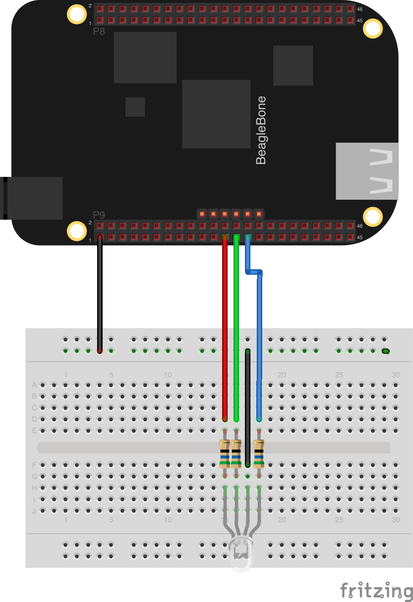

## Control an RGB LED using Zetta and bonescript!

### Install

```
$> npm install zetta-rgb-bonescript-driver
```

### Usage

```
var zetta = require('zetta');
var LED = require('zetta-rgb-bonescript-driver');

zetta()
  .use(LED)
  .listen(1337)

// or define custom pins

var zetta = require('zetta');
var LED = require('../index');

zetta()
  .use(LED, { rLed: 'P9_23', gLed: 'P9_25', bLed: 'P9_27' })
  .listen(1337);

```

### Hardware

* [Beagle Bone](http://beagleboard.org/black)
* [RGB LED](https://www.sparkfun.com/products/10820)
* 56 Ohm Resistor x 3



### Transitions

#### #toggleRed

No arguments. Turns the red led on or off. Depends on state.

##### toggleGreen

No arguments. Turns the green led on or off. Depends on state.

##### toggleBlue

No arguments. Turns the blue led on or off. Depends on state.

##### setColor

Hex string color code. Sets led color based on string passed in.
